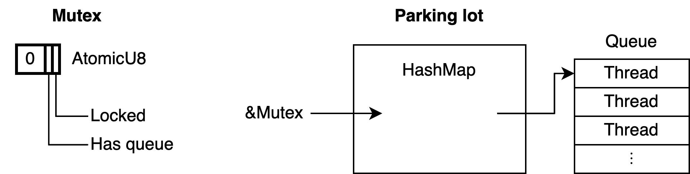

# 第十章：主意和灵感

有无数与并发相关的话题、算法、数据结构、轶事以及其它可能的章节都可能成为本书的一部分。然而，我们已经到了最后一章，我们即将分道扬镳，希望给你新的可能性和激动的感觉，并准备在实践中应用新的知识和技能。

最终章节的目的是为了向你展示一些可以学习、探索和构建的想法，为你自己的创建和未来工作提供灵感。

## 信号量[^1]

*信号量*实际上仅是有两个操作的计数器：*信号*（signal，也叫做 up 或 V）和*等待*（wait，也叫做 down 或 P）。signal 操作增加计数器到一个确定的最大值，而 wait 操作减少计数器的值。如果计数器是 0，wait 操作将阻塞并等待匹配的 signal 操作，以防止计数器将变成负数。这是一个灵活的工具，可以用于实现其它同步原语。

信号量可以实现为用于计数器的 `Mutex<u32>` 以及用于等待操作的 `Condvar` 的组合。然而，有几种方式能更有效地实现它。更值得关注的是，在支持类 futex 操作（[第八章“futex”](./8_Operating_System_Primitives.md#futex)）的平台上，它可以作为单个 AtomicU32（或者甚至 AtomicU8）更高效地实现。

最大值为 1 的信号量又是被称为*二进制*信号量，它可以用作构建其他原语的基石。例如，它可以通过初始化计数器、使用锁定的 wait 操作以解锁的 signal 操作来做用于 mutex。通过在 0 处初始化它，它可以被用作信号，就像条件变量一样。例如，在标准库 `std::thread` 的 `park()` 的 `unpark()` 函数可以实现与线程关联的二进制信号量上的 wait 和 signal 操作。

> 注意，mutex 可以使用信号量来实现，而信号量可以使用 mutex（或者条件变量）来实现。建议避免使用基于 mutex 的信号量来实现基于信号量的 mutex，反之亦然。

进一步阅读：

* [维基百科的信号量文章](https://en.wikipedia.org/wiki/Semaphore_(programming))
* [斯坦福大学关于信号量的课程的笔记](https://see.stanford.edu/materials/icsppcs107/23-Concurrency-Examples.pdf)

## RCU

如果你想要多个线程去（更多地）读和（少量地）更改一些数据，你可以使用 RwLock。当这些数据仅是单个整数时，你可以使用单个原子变量（例如 `AtomicU32`）去避免锁定，这样更有效。然而，对于巨大数据的分块，像有着很多字段的结构体，没有可用的原子类型允许对整个对象进行无锁原子操作。

就像计算机科学中的其他问题一样，该问题也可以通过增加间接的层来解决。你可以使用原子变量去存储一个指向它的指针，而不是结构体本身。这仍然不允许你以原子地方式修改整个结构体，但它允许你以原子地方式替换整个结构体，这差不多。

这种模式通常称为 `RCU`，代表“读取、复制、更新”，这些替换数据所需要的步骤。读取指针后，可以将结构体复制进新的分配，无需担心其他线程即可进行修改。准备就绪后，可以使用比较并交换操作（[第二章节的“比较并交换”操作](./2_Atomics.md#比较并交换操作)）来更新原子指针，如果没有其他线程在此期间替换数据，这将成功。

关于 RCU 模式最有趣的部分是最后一步，它没有首字母缩略的单词：重新分配旧数据（deallocating the old data）。成功更新后，如果其他线程在更新前读取指针，它们仍然可能读取旧副本。你必须等待所有这些线程的完成，才能重新分配旧副本。

对于这个问题有很多可能的解决方案，包括引用计数（例如 `Arc`）、泄漏内存（忽视问题）、垃圾收集、冒险指针[^2]（线程告诉其他线程它们当前正在使用什么指针的方式）以及静态状态跟踪（等待每个线程达到不再使用任何指针的点）。最后一个在某些情况下非常高效。

在 Linux 内核中的很多数据结构是基于 RCU 的，并且有很多关于它们实现地方有意思的讨论和文章，这可以提供一个很棒的灵感。

进一步阅读：

* [维基百科的 RCU 文章](https://en.wikipedia.org/wiki/Read-copy-update)
* [LWN 文章“从根本上说，什么是 RCU？”](https://lwn.net/Articles/262464/)

## 无锁链表

扩展基本的 RCU 模式，你可以增加一个原子指针到结构体以指向下一个，以将其转换为*链表*。这允许线程以原子地方式增加或移除链表中的元素，而无需每次更新时复制整张表。

为了在表开始插入一个新元素，你仅需要分配该元素并将它的指针指向列表中的第一个元素，然后原子更新初始化指针以指向你最新分配到元素。

同样，移除元素可以通过更新元素之前（元素）的指针指向后一个元素来完成。然而，当涉及多个 writer 时，必须处理相邻元素的并发插入或者删除操作。否则，你可能还会意外地并发地移除新插入的元素，或者撤销了并发移除的元素的移除。

> 为了保持简单，你可以使用常规的 mutex 来避免并发的修改。这样，读仍然是一个无锁操作，但是你不需要担心处理并发修改。

从链表列表中分离元素后，你将遇到与之前相同的问题：它会等待，直到你解除分配（或者以其他方式宣称所有权）。在这种情况下，我们讨论的基本的 RCU 模式的相同解决方案也有效。

总的来说，你可以基于原子指针上的比较并交换操作，构建各种精心设计的无锁数据结构，但是你将总是需要一个好的策略来释放分配或者以其他方式收回分配的所有权。

进一步阅读：

* [维基百科的非阻塞链表](https://en.wikipedia.org/wiki/Non-blocking_linked_list)
* [LWN文章“为链表使用 RCU——案例研究”](https://lwn.net/Articles/610972/)

## 基于队列的锁

对于大多数标准锁定的原语，操作系统内核都会跟踪被阻塞的线程，并负责在被询问时，挑选一个线程来唤醒。一个有趣的替代方案是通过手动地跟踪等待线程的队列来实现 mutex（或者其他锁定原语）。

例如一个 mutex 可能作为单个 AtomicPtr 实现，其可以指向一个等待线程（列表）。

在这个列表中的每个元素都需要包含一些字段，这些字段用于唤醒相应的线程，例如 `std::thread::Thread` 对象。一些原子指针未使用的位可以用于存储 mutex 自身的状态，以及管理队列状态的任何所需的东西。

有很多可能的变体。队列可能由它自己的锁位保护，或者也可以实现为（部分地）无锁结构。元素不必在堆上分配，而可以时等待的线程的局部变量。队列可以是一个双向链表，不仅包含指向下一个元素的指针，同时也包含指向前一个元素。第一个元素也包含一个指向最后元素的指针，以便高效地在末尾追加一个元素。

这种模式仅允许使用可以用于阻塞和唤醒单个线程的方式（例如 `parking`）来高效地锁定原语。

Windows SRW 锁（[第8章中的“一个轻巧的读写锁”](./8_Operating_System_Primitives.md#一个轻巧的读写锁)）使用此模式实现。

进一步阅读：

* [关于 Windows SRW 锁的实现](https://oreil.ly/El8GA)
* [基于队列的锁的 Rust 实现](https://oreil.ly/aFyg1)

## 基于阻塞的锁

为了创建一个尽可能小的高效 mutex，你可以通过将队列移动到全局的数据结构，在 mutex 自身只留下 1 或者 2 个位，来构建基于队列的锁的想法。这样，mutex 仅需要是一个字节。你甚至可以把它放置在一些未使用的指针位中，这允许非常细粒度的锁定，几乎没有其他额外的开销。

全局的数据结构可以是一个 `HashMap`，将内存地址映射到等待该地址的 mutex 的线程队列。全局的数据结构通常叫做 `parking lot`，因为它是一组被阻塞（`park`）的线程合集。

这种模式可以是泛化的，其不仅跟踪 mutex 的队列，同时也还跟踪条件变量和其他原语。通过跟踪任何原子变量的队列，这有效地提供了一种不在原生支持该功能的平台上实现类似 futex 功能的方式。

这种模式最出名的是 2015 年在 WebKit 中的实现，在那里它被用来锁定 JavaScript 对象。它的实现启发了其他实现，例如流行的 parking_lot Rust crate。

进一步阅读：

* [WebKit 博客，“在 WebKit 中的锁定”](https://oreil.ly/6dPim)
* [parking_lot crate 的文档](https://oreil.ly/UPcXu)

## 顺序锁（SpinLock）

顺序锁是不使用传统（阻塞）锁的原子更新（巨大）的数据的另一种解决方案。当数据正在更新时，甚至数据正在准备读取时，它使用一个奇数的原子计数器。

在更改数据之前，写入线程必须将计数器从偶数递增到奇数，之后它必须再次递增计数器以使其保持（不同的）偶数值。

任何读取线程都可以在任何时候，在不阻塞的情况下，通过在前后读取计数器来读取数据。如果来自计数器的两个值是相等的或是偶数，就没有并发更改，这意味着你读取了有效的数据副本。否则，你可能读取的数据被并发地修改了，在这种情况下，你应该再次尝试。

这是一个向其他线程提供数据的绝佳模式，而不会使读线程阻塞写线程。它通常用在操作系统内核和许多嵌入式系统。因为 reader 仅需要对内存的读取访问，并没有涉及指针，因此这可以是一个很好的数据结构，可以在共享内存中安全地使用，在处理器之间，而无需信任 reader。例如，Linux 内核使用这个模式通过为进程提供对（共享）内存的只读访问，非常有效地为进程提供时间戳。

一个有趣的问题是，这如何融入内存模型。对相同数据的并发非原子读和写会导致未定义的行为，即使读取数据被忽略。这意味着，从技术上讲，读和写操作都应该仅使用原子操作，尽管整个读或者写并不必须是单一的原子操作。

## 教学材料

花费许多小时——或者许多年——去发明新的并发数据结构和设计人性化的 Rust 实现是非常有趣的。如果你正在寻找与 Rust、原子操作、锁、并发数据结构以及并发性相关的其他知识，那么创建新的教材与其他人分享你的知识也非常有成就感。

对于这些主题的初学者，缺乏可接触的资源。Rust 在使系统编程对所有人更易接触方面扮演一个重要的角色，但很多程序员仍然避免底层并发。原子操作通常被认为是一个略微神秘的主题，最后留给一小部分专家，这是可惜的。

我希望这本书能够产生显著的影响，但是对于更多的书籍、博客、文章、视频课程、会议演讲和其他关于 Rust 的并发材料，还有很大空间。

[^1]: <https://zh.wikipedia.org/wiki/信号量>
[^2]: <https://zh.wikipedia.org/wiki/冒险指针>
