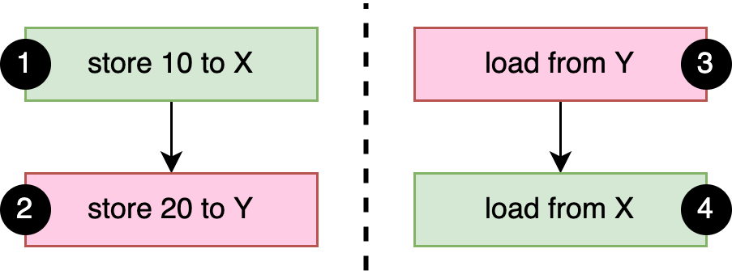
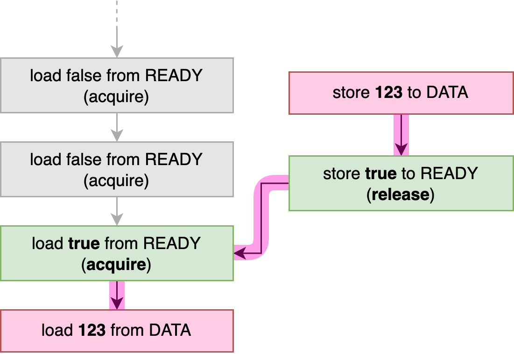
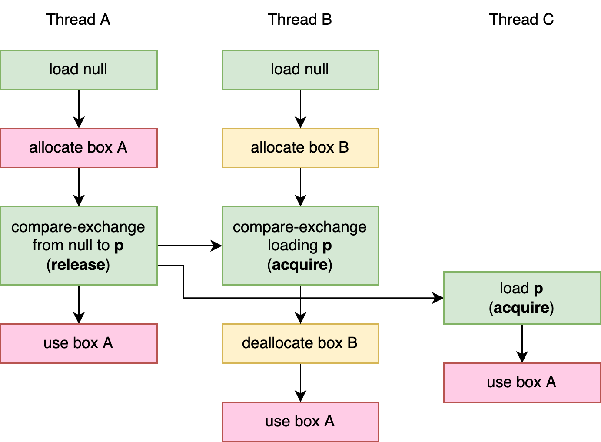

# 第三章：内存排序[^1]

在[第二章](./2_Atomics.md)，我们简要地谈到了内存排序的概念。在该章节，我们将研究这个主题，并探索所有可用的内存排序选项，并且，更重要地是，我们将学习如何使用它们。

## 重排和优化

处理器和编译器执行各种技巧，以便使你的程序运行地尽可能地快。例如，处理器可能会确定你程序中的两个连续指令不会相互影响，并且如果这样更快，就会按顺序执行它们。当一个指令在从主存中获取一些数据被短暂地阻塞了，几个后续地指令可能在在第一个指令结束之前被执行和完成，只要这不会更改你程序的行为。类似地，编译器可能会决定重排或者重写你程序的部分代码，如果它有理由相信这可能会导致更快地执行。但是，同样地，仅有在不更改你程序行为的情况下。

让我们来看看一下这个例子：

```rust
fn f(a: &mut i32, b: &mut i32) {
    *a += 1;
    *b += 1;
    *a += 1;
}
```

这里，编译器肯定会明白，操作的顺序并不重要，因为在这三个加法操作之间没有发生任何依赖于 `*a` 或 `*b` 的操作（假设溢出检查被禁用）。因此，编译器可能会重新排序第二个和第三个操作，然后将前两个操作合并为单个加法操作：

```rust
fn f(a: &mut i32, b: &mut i32) {
    *a += 2;
    *b += 1;
}
```

稍后，在执行优化编译程序的函数时，由于各种原因，处理器可能最终在执行第一次加法操作之前，执行第二次加法操作，可能是 `*b` 在缓存中可用，而 `*a` 在主内存可获取。

无论这些优化如何，结果都是相同的： `*a` 递增 2，`*b` 递增 1。它的递增的顺序对于你程序的其余部分完全不可见。

验证特定的重新排序或者其他优化并不影响程序的行为的逻辑并不需要考虑其他线程。在我们上面的示例中，这是极好的，因为独占引用（`&mut i32`）保证没有其他线程可以访问这个值。出现问题的唯一情况是，当共享的数据在线程之间发生改变。或者，换句话说，当使用原子操作时。这就是为什么，我们必须明确地告诉编译器和处理器，它们可以和不能使用我们的原子操作做什么，因为它们通常的逻辑忽略了线程之间的交互，并且可能允许的优化，会导致我们程序的结果改变。

有趣的问题是我们*如何*告诉它们。如果我们想要准确地阐明什么是可以接受的，什么是不可以接受的，并发程序将变得非常冗长并很容易出错，并且可能特定于架构：

```rust
let x = a.fetch_add(1,
    Dear compiler and processor,
    Feel free to reorder this with operations on b,
    but if there's another thread concurrently executing f,
    please don't reorder this with operations on c!
    Also, processor, don't forget to flush your store buffer!
    If b is zero, though, it doesn't matter.
    In that case, feel free to do whatever is fastest.
    Thanks~ <3
);
```

的确，我们仅能从一小部分选项中进行选择，这些选项由 `std::sync::atomic::Ordering` 枚举表示，每个原子操作都将其作为参数。可用选项的部分是非常有限的，但是经过精心挑选，可以适用大部分用例。排序是非常抽象的，并且不能直接反映实际编译器和处理器涉及的机制，例如指令重排。这使得你的并发代码可以脱离架构并且面向未来。它允许在不知道每个当前和未来处理器版本的信息的情况下进行验证。

在 Rust 中可用的排序：

* Relaxed 排序：`Ordering::Relaxed`
* Release 和 acquire 排序：`Ordering::{Release, Acquire, AcqRel}`
* 顺序一致性排序：`Ordering::SeqCst`

在 C++ 中，有一种叫做 *consume ordering*，它在 Rust 中被省略了，尽管如此，对它的讨论也是很有用的。

## 内存模型

不同的内存排序选项有一个严格的形式定义，以确保我们确切地知道我们允许假设什么，并且让编译器编写者确切知道它们需要向我们提供什么。为了将它与特定处理器架构的细节解耦，内存排序是根据抽象*内存模型*定义的。

Rust 的内存模型，它更多的抄自 C++，与任何现有的处理器架构不匹配，而是一个抽象模型，它有一套严格的规则，试图带面当前和未来所有架构的最大公约数吗，同时基于编译器足够的自由去进行程序分析和优化时作出有用的假设。

我们已经在[第一章的“借用和数据竞争”]看到内存模型的一部分，我们讨论了数据竞争如何导致未定义行为。Rust 的内存模型允许并发的原子存储，但将并发的非原子存储到相同的变量视为数据竞争，这将导致未定义行为。

然而，在大多数处理器架构中，原子存储之间和常规非原子存储之间并没有什么区别，我们将在[第七章](./7_Understanding_the_Processor.md)看到这些。人们可以争辩说，内存模型的限制性比必要性要强，但这些严格的规则使编译器和程序员更容易对程序进行推理，并为未来的发展留下了空间。

## Happens-Before 关系

内存模型定义了操作在 *happens-before 关系*发生的顺序。这意味着，作为一个抽象模型，它不涉及机器指令、缓存、缓冲区、时间、指令重排、编译优化等，而只定一个了一件事情在另一件事情之前保证发生的情况，并将其它一切的顺序都视为未定义的。

基础的 happens-before 规则是同一线程内的任何事情都按顺序发生。如果线程线程正在执行 `f(); g();`，那么 `f()` 在 `g()` 之前发生。

然而，在线程之间，发生在特定的情况下的 happens-before 关系笔记哦啊有限，例如，在创建和等待线程时，解锁和锁定 mutex，以及使用非 relaxed 的原子操作。Relaxed 内存排序时最基本的（也是性能最好的）内存排序，它本身并不会导致任何跨线程的 happens-before 关系。

为了探索这意味着什么，让我们看看以下示例，我们假设 a 和 b 有不同的线程并发执行：

```rust
static X: AtomicI32 = AtomicI32::new(0);
static Y: AtomicI32 = AtomicI32::new(0);

fn a() {
    X.store(10, Relaxed); // 1
    Y.store(20, Relaxed); // 2
}

fn b() {
    let y = Y.load(Relaxed); // 3
    let x = X.load(Relaxed); // 4
    println!("{x} {y}");
}
```

正如以上提及的，基础的 happens-before 规则是同一线程内的任何事情都按顺序发生。因在这个示例中，1 发生在 2 之前，并且 3 发生在 4 之前，正如 3-1 图片所示。因为我们使用 relaxed 内存排序，在我们的示例中并没有其它的 happens-before 关系。


图3-1。示例代码中原子操作之间的 happens-before 关系。

如果 a 或 b 的任何一个在另一个开始之前完成，输出将是 0 0 或 10 20。如果 a 和 b 并发地运行，很容易看见输出是 10 0。发生这种操作的方式是，可能以以下顺序写运行：3 1 2 4。

更有趣地是，输出可以也是 0 20，尽管导致这个结果的操作不可能有全局地一致性顺序。当 3 被执行，它与 2 之间不存在 happens-before 关系，这意味着它可以加载 0 或 20。当 4 被执行，它与 1 之间不存在 happens-before 关系，这意味它可以加载 0 或 10。因此，输出 0 20 是一种有效的结果。

需要理解的重要和反直觉的是操作 3 加载值 20 并不能与 2 操作形成 happens-before 关系，即使这个值是由操作 2 存储的。我们对“之前”的概念的直觉是，在事情不一定按照全局一致性的顺序发生时会被打破，比如涉及指令重排的情况。

一个更有用并且直观，但是不太正式的理解是，从执行 b 的线程的视角来看，操作 1 和 2 可能以相反的顺序发生。

### spawn 和 join

产生的线程会创建一个 happens-before 关系，它将发生在 `spawn()` 之前的事件与新线程关联起来。同样地，join 线程创建一个 happens-before 关系，它将发生在 `join()` 调用之后的事件与被 join 的线程关联起来。

为了证明，以下示例中的断言不能失败：

```rust
static X: AtomicI32 = AtomicI32::new(0);

fn main() {
    X.store(1, Relaxed);
    let t = thread::spawn(f);
    X.store(2, Relaxed);
    t.join().unwrap();
    X.store(3, Relaxed);
}

fn f() {
    let x = X.load(Relaxed);
    assert!(x == 1 || x == 2);
}
```

由于 join 和产生操作形成的 happens-before 关系，我们肯定知道 X 的加载操作在第一个 store 之后，但在随后一个 store 之前，正如在图 3-2 所见。然而，它是否在第二个存储之前或之后观察值是不可预测的。换句话说，它可能是 1 或 2，但不是 0 或 3。


图 3-2。示例代码中生成、join、存储和加载操作之间的 happens-before 关系。

## Relaxed 排序

当原子操作使用 relaxed 内存排序并不会提供任何 happens-before 关系，但是它们仍然保证了每个原子变量的*总的修改顺序*。这意味着，从线程的角度来看，*同一原子变量*的所有修改都是以相同的顺序进行的。

为了证明这意味着什么，我们假设 a 和 b 由不同的线程并发执行，考虑以下示例：

```rust
static X: AtomicI32 = AtomicI32::new(0);

fn a() {
    X.fetch_add(5, Relaxed);
    X.fetch_add(10, Relaxed);
}

fn b() {
    let a = X.load(Relaxed);
    let b = X.load(Relaxed);
    let c = X.load(Relaxed);
    let d = X.load(Relaxed);
    println!("{a} {b} {c} {d}");
}
```

在该示例中，仅有一个线程修改 X，这使得很轻松地能够看到 X 的修改顺序：0→5→15。它从 0 开始，然后变成 5，最终变成 15。线程并不能从 X 中观察到与此总修改不一致的任何值。这意味着“0 0 0 0”、“0 0 5 15”和“0 15 15 15”是来自另一个线程打印语句的可能的一些结果，而“0 5 0 15”或“0 0 10 15”的输出是不可能的。

即使原子变量有多个可能的修改顺序，所有线程也仅同意一个顺序。

让我们用两个单独的函数替换 a1 和 a2，我们假设它们分别由一个单独的线程执行：

```rust
fn a1() {
    X.fetch_add(5, Relaxed);
}

fn a2() {
    X.fetch_add(10, Relaxed);
}
```

假设这些是唯一修改 X 的线程，现在有两种修改顺序：要么是 0→5→15 或 0→10→15，这取决于哪个 fetch_add 操作先执行。无论哪种情况，所有线程都遵守相同的顺序。因此，即使我们即使我们有数百个额外的线程正在运行我们的 `b()` 函数，我们知道如果其中一个打印出 10，那么顺序必须是 0→10→15，而它们其中的任何一个都不可能打印出 5。反之亦然。

在[第二章](./2_Atomics.md)，我们看见几个用例示例，其中保证个别变量的总修改顺序就足够了，使用 Relaxed 内存排序足够了。然而，如果我们尝试任何超出这些示例更高级的东西，我们将很快发现，需要比 relaxed 更强的保证。

<div style="border:medium solid green; color:green;">
  <h2 style="text-align: center;">凭空出现的值</h2>
  在使用 Relaxed 内存排序时，由于缺乏顺序保证，当操作在循环方式下相互依赖时，可能会导致理论上的复杂情况。

  为了演示，这里有一个人为的例子，两个线程从一个原子加载一个值，并将其存储在另一个原子中：

  <pre>static X: AtomicI32 = AtomicI32::new(0);
static Y: AtomicI32 = AtomicI32::new(0);

fn main() {
    let a = thread::spawn(|| {
        let x = X.load(Relaxed);
        Y.store(x, Relaxed);
    });
    let b = thread::spawn(|| {
        let y = Y.load(Relaxed);
        X.store(y, Relaxed);
    });
    a.join().unwrap();
    b.join().unwrap();
    assert_eq!(X.load(Relaxed), 0); // Might fail?
    assert_eq!(Y.load(Relaxed), 0); // Might fail?
}</pre>

  似乎很容易得出 X 和 Y 的值不会时除 0 以外的任何东西的结论，因为 store 操作仅从这项相同的原子中加载值，而这些原子仅是 0。

  然而，如果我们严格遵循理论内存模型，我们必须面对循环推理，并得出可怕的结论，我们可能错了。事实上，内存模型在技术上允许出现这样的结果，即最终 X 和 Y 都是 37，或者任意其它的值，导致断言失败。

  由于缺饭顺序保证，这两个线程的 load 操作可能都看到另一个线程 store 操作的结果，允许按操作顺序循环：我们在 Y 中存储 37，因为我们从 X 加载了 37，X 存储到 X，因为我们从 Y 加载了 37，这是我们在 Y 中存储的值。

  幸运的是，这种*凭空捏造*值的可能性在理论模型中被普遍认为是一个 bug，而不需要你在实践中考虑。如何在不允许这种异常情况的情况下形式化 relaxed 内存排序还是一个未解决的问题。尽管这对于形式化验证来说可能是一个问题，让许多理论家夜不能寐，但是我们其他人可以放心地使用 relaxed，因为在实践中不会发生这种情况。
</div>

## Release 和 Acquire 排序

*Release* 和 *Acquire* 内存排序通常成对使用，它们用于形成线程之间的 happens-before 关系。`Release` 内存排序适用于 store 操作，而 `Acquire` 内存排序适用于 load 操作。

当 acquire-load 操作观察 release-store 操作的结果时，就会形成 happens-before 关系。在这种情况下，store 操作极其之前的所有操作在时间上先于 load 操作和之后的所有操作。

当使用 Acquire 进行「获取和修改」或者「比较和交换」操作时，它仅适用于操作的 load 部分。类似地，Release 仅适用于操作的 store 部分。`AcqRel` 用于表示 Acquire 和 Release 的组合，这既能使 load 使用 Acquire，也能使 store 使用 Release。

让我们回顾一个示例，看看我们在实践中如何使用它们。在以下示例中，我们将一个 64 位整数从产生的线程发送到主线程。我们使用一个额外的原子布尔类型以指示主线程，整数已经被存储并且已经可以读取：

```rust
use std::sync::atomic::Ordering::{Acquire, Release};

static DATA: AtomicU64 = AtomicU64::new(0);
static READY: AtomicBool = AtomicBool::new(false);

fn main() {
    thread::spawn(|| {
        DATA.store(123, Relaxed);
        READY.store(true, Release); // Everything from before this store ..
    });
    while !READY.load(Acquire) { // .. is visible after this loads `true`.
        thread::sleep(Duration::from_millis(100));
        println!("waiting...");
    }
    println!("{}", DATA.load(Relaxed));
}
```

当产生的线程完成数据存储时，它使用 release-store 去设置 `READY` 标志为真。当主线程通过它的 acquire-load 操作观察到，在这两个线程之间建立了一个 happens-before 关系，正如图 3-3 所示。此时，我们肯定知道在 release-store 到 READY 之前的所有操作对发生在 acquire-load 之后的所有操作都可见。具体而言，当主线程从 `DATA` 加载时，我们可以肯定它将加载由后台线程存储的值。该程序在最后一行只有一种输出结果：123。



图 3-3。示例代码中原子操作之间的 happens-before 关系，展示了通过 acquire 和 release 操作形成的跨线程关系。

如果我们在这个示例为所有操作使用 relaxed 内存排序，主线程可能会看到 `READY` 翻转为 true，而之后仍然从 DATA 中加载 0。

> “Release”和“Acquire”的名称基于它们最基本用例：一个线程通过原子地存储一些值到原子变量来发布数据，而另一个线程通过原子地加载这个值来获取数据。这正是当我们解锁（释放）互斥体并随后在另一个线程上锁定（获取）它时发生的情况。

在我们的示例中，来自 READY 标志的 happens-before 关系保证了 DATA 的 store 和 load 操作不能并发地发生。这意味着我们实际上不需要这些操作是原子的。

然而，如果我们仅是为我们的数据变量尝试去使用常规的非原子类型，编译器将拒绝我们的程序，因为当另一个线程也在借用它们，Rust 的类型系统不允许我们修改它们。类型系统不会理解我们在这里创建的 happens-before 关系。一些不安全的代码是必要的，以向编译器承诺我们已经仔细考虑过这个问题，我们确信我们没有违反任何规则，如下所示：

```rust
static mut DATA: u64 = 0;
static READY: AtomicBool = AtomicBool::new(false);

fn main() {
    thread::spawn(|| {
        // Safety: Nothing else is accessing DATA,
        // because we haven't set the READY flag yet.
        unsafe { DATA = 123 };
        READY.store(true, Release); // Everything from before this store ..
    });
    while !READY.load(Acquire) { // .. is visible after this loads `true`.
        thread::sleep(Duration::from_millis(100));
        println!("waiting...");
    }
    // Safety: Nothing is mutating DATA, because READY is set.
    println!("{}", unsafe { DATA });
}
```

<div style="border:medium solid green; color:green;">
  <h2 style="text-align: center;">更正式地</h2>
  当 acquire-load 操作观察 release-store 操作的结果时，就会形成 happens-before 关系。但那是什么意思？

  想象一下，两个线程都将一个 7 release-store 到相同的原子变量中，第三个线程从该变量中加载 7。第三个线程和第一个或者第二个线程有一个 happens-before 关系吗？这取决于它加载“哪个 7”：线程一还是线程二的。（或许一个不相关的 7）。这使我们得出的结论是，尽管 7 等于 7，但两个 7 与两个线程有一些不同。

  思考这个问题的方式是我们在[“Relaxed 排序”](#relaxed-排序)中讨论的*总修改顺序*：发生在原子变量上的所有修改的有序列表。即使将相同的值多次写入相同的变量，这些操作中的每一个都以该变量的总修改顺序代表一个单独的事件。当我们加载一个值，加载的值与每个变量“时间线”上的特定点相匹配，这告诉我们我们可能会同步哪个操作。

  例如，如果原子总修改顺序是

  1. 初始化为 0

  2. Release-store 7（来自线程二）
  
  3. Release-store 6

  4. Release-store 7（来自线程一）

  然后，acquire-load 7 将与第二个线程的 release-store 或者最后一个事件的 release-store 同步。然而，如果我们之前（就 happens-before 关系而言）见过 6，我们知道我们看到的是最后一个 7，而不是第一个 7，这意味着我们现在与线程一有 happens-before 的关系，而不是线程二。

  还有一个额外的细节，即 release-stored 的值可能会被任意数量的「获取并修改」和「比较并交换」操作修改，但仍会导致与 acquire-load 读取最终结果的 happens-before 关系。

  例如，想象一个具有以下总修改顺序的原子变量：

  1. 初始化为 0
  
  2. Release-store 7

  3. Relaxed-fetch-and-add 1，改变 7 到 8

  4. Relaxed-fetch-and-add 1，改变 8 到 9

  5. Release-store 7

  6. Relaxed-swap 10，改变 7 到 10

  现在，如果我们在这个变量上执行 acquire-load 到 9，我们不仅与第四个操作（存储此值）建立了一个 happens-before 关系，同时也与第二个操作（存储 7）建立了该关系，即使第三个操作使用了 Relaxed 内存排序。

  相似地，如果我们在这个变量上执行 acquire-load 到 10，而该值是由一个 relaxed 操作写入的，我们仍然建立了与第五个操作（存储 7）的 happens-before 关系。因为它只是一个普通的存储操作（不是「获取并修改」或「比较并交换」操作），它打破了规则链：我们没有与其他操作建立 happens-before 关系。
</div>

### 示例：锁定

互斥锁是 release 和 acquire 排序的最常见用例（参见[第一章的“锁：互斥锁和读写锁”](./1_Basic_of_Rust_Concurrency.md#锁互斥锁和读写锁)）。当锁定时，它们使用 acquire 排序的原子操作来检查是否它已解锁，同时也（原子地）改变状态到“锁定”。当解锁时，它们使用 release 排序设置状态到“解锁”。这意味着，在解锁 mutex 和随后锁定它有一个 happens-before 关系。

以下是这种模式的演示：

```rust
static mut DATA: String = String::new();
static LOCKED: AtomicBool = AtomicBool::new(false);

fn f() {
    if LOCKED.compare_exchange(false, true, Acquire, Relaxed).is_ok() {
        // Safety: We hold the exclusive lock, so nothing else is accessing DATA.
        unsafe { DATA.push('!') };
        LOCKED.store(false, Release);
    }
}

fn main() {
    thread::scope(|s| {
        for _ in 0..100 {
            s.spawn(f);
        }
    });
}
```

正如我们在[第二章“比较并交换操作”](./2_Atomics.md#比较并交换操作)简要地所见，比较并交换采用两个内存排序参数：一个用于比较成功且 store 发生的情况，一个用于比较失败且 `store` 没有发生的情况。在 f 中，我们试图去改变 `LOCKED` 的值从 false 到 true，并且只有在成功的情况下才能访问 DATA。所以，我们仅关心成功的内存排序。如果 `compare_exchange` 操作失败，那一定是因为 `LOCKED` 已经设置为 true，在这种情况下 f 不会做任何事情。这与常规 mutex 上的 `try_lock` 操作相匹配。

> 观察力强的读者可能已经注意到，比较并交换操作也可能是交换操作，因为在已锁定时将 true 替换为 true 不会改变代码的正确性：
>
> ```rust
> // This also works.
> if LOCKED.swap(true, Acquire) == false {
>    // …
> }
> ```

归功于 acquire 和 release 内存排序，我们肯定没有两个线程能并发地访问数据。正如在图 3-4 展示的，对 DATA 的任何先前访问都在随后使用 release-store 操作将 false 存储到 LOCKED 之前发生，然后在下一个 acquire-compare-exchange（或 acquire-swap）操作中将 false 更改为 true，然后在下一次访问 DATA 之前发生。


图 3-4。锁定示例中原子操作之间的 happens-before 关系，显示了两个线程按顺序锁定和解锁。

在[第四章](./4_Building_Our_Own_Spin_Lock.md)，我们将把这个概念变成一个可重复使用的类型：自旋锁。

### 示例：使用间接的方式惰性初始化

在[第二章的“示例：惰性一次性初始化”](./2_Atomics.md#示例惰性一次性初始化)中，我们实现一个全局变量的惰性初始化，使用「比较且交换」操作去处理多个线程竞争同时初始化值的情况。由于该值是非零的 64 位整数，我们能够使用 AtomicU64 来存储它，在初始化之前使用零作为占位符。

要对不适合单个原子变量的更大的数据类型做同样的事情，我们需要寻找替代方案。

在这个例子中，假设我们想保持非阻塞行为，这样线程就不会等待另一个线程，而是从第一个线程中竞争并获取值来完成初始化。这意味着我们仍然需要能够在单个原子操作中从“未初始化”到“完全初始化”。

正如软件工程的基本定理告诉我们的那样，计算机科学中的每个问题都可以通过添加另一层间接来解决，这个问题也不例外。由于我们无法将数据放入单个原子变量中，因此我们可以使用原子变量来存储指向数据的*指针*。

`AtomicPtr<T>` 是 `*mut T` 的原子版本：指向 T 的指针。我们可以使用空指针作为初始状态的占位符，并使用比较并交换操作将其原子地替换为指向新分配的、完全初始化的 T 的指针，然后可以由其他线程读取。

由于我们不仅共享包含指针的原子变量，还共享它所指向的数据，因此我们不能再像[第2章](./2_Atomics.md)那样使用 Relaxed 的内存排序。我们需要确保数据的分配和初始化不会与读取数据竞争。换句话说，我们需要在 store 和 load 操作上使用 release 和 acquire 排序，以确保编译器和处理器不会通过，例如，重新排序指针的存储和数据本身的初始化来破坏我们的代码。

对于一些名为 Data 的任意数据类型，这引出了以下实现：

```rust
use std::sync::atomic::AtomicPtr;

fn get_data() -> &'static Data {
    static PTR: AtomicPtr<Data> = AtomicPtr::new(std::ptr::null_mut());

    let mut p = PTR.load(Acquire);

    if p.is_null() {
        p = Box::into_raw(Box::new(generate_data()));
        if let Err(e) = PTR.compare_exchange(
            std::ptr::null_mut(), p, Release, Acquire
        ) {
            // Safety: p comes from Box::into_raw right above,
            // and wasn't shared with any other thread.
            drop(unsafe { Box::from_raw(p) });
            p = e;
        }
    }

    // Safety: p is not null and points to a properly initialized value.
    unsafe { &*p }
}
```

如果我们以 acquire-load 操作从 PTR 得到的指针是非空的，我们假设它指向已初始化的数据，并构建对该数据的引用。

然而，如果它仍然为空，我们会生成新数据，并使用 `Box::new` 将其存储在新分配中。然后，我们使用 `Box::into_raw` 将此 `Box` 转换为原始指针，因此我们可以尝试使用比较并交换操作将其存储到 PTR 中。如果另一个线程赢得初始化竞争，`compare_exchange` 将失败，因为 PTR 不再是空的。如果发生这种情况，我们将原始指针转回 Box，使用 `dro`p 来解除分配，避免内存泄漏，并继续使用另一个线程存储在 PTR 中的指针。

在最后的不安全块中，关于安全性的注视表明我们的假设是指它指向的数据已经被初始化。注意，这包括对事情发生顺序的假设。为了确保我们的假设成立，我们使用 release 和 acquire 内存顺序来确保初始化数据实际上在创建对其的引用之前已经发生。

我们在两个地方加载一个潜在的非空（即初始化）指针：通过 load 操作和当 compare_exchange 失败时的该操作。因此，如上所述，我们需要在 load 内存顺序和 compare_exchange 失败内存顺序上都使用 Acquire，以便能够与存储指针的操作进行同步。当 compare_exchange 操作成功时，会发生 store 操作，因此我们必须使用 Release 作为其成功的内存顺序。

图 3-5 显示了三个线程调用 `get_data()` 的情况的操作和发生前关系的可视化。在这种情况下，线程 A 和 B 都观察到一个空指针并都试图去初始化原子指针。线程 A 赢得竞争，导致线程 B 的 compare_exchange 调用失败。线程 C 在通过线程 A 初始化之后观察原子指针。最终结果是，所有三个线程最终都使用由线程 A 分配的 box。


图3-5。调用 `get_data()` 的三个线程之间的操作和发生前关系。

## Consume 排序

让我们仔细看看上一个示例中的内存排序。如果我们把严格的模型放在一边，从更实际的方面来思考它，我们可以说 release 排序阻止了数据的初始化与共享指针的 store 操作重新排序。这一点非常重要，因为否则其它线程可能会在数据完全初始化之前就能看到它。

类似地，我们可以说 acquire 排序为防止重新排序，使得数据在加载指针之前被访问。然而，人们可能合理地质疑，在实践中是否有意义。在地址加载之前，如何访问数据？我们可能会得出结论，若于 acquire 排序的内存顺序可能足够。我们的结论是正确的：这种较弱的内存顺序被称为 consume 排序。

consume 排序是 acquire 排序的一个轻量级、更高效的变体，其同步效果仅限于依赖于已加载值的操作。

这意味着如果你用 consume-load 从一个原子变量中加载一个通过 release 存储的值 x，那么基本上，这个 store 操作发生在依赖表达式（如 `*x`、`array[x]` 或 `table.lookup(x + 1)`）的求值之前，但不一定发生在独立操作（如读取另一个与 x 无关的变量）之前。

现在有好消息和坏消息。

好消息是，在所有现代处理器架构上，consume 排序是通过与 relaxed 排序完全相同的指令实现的。换句话说，consume 排序可以是“免费的”，而 acquire 内存排序在某些平台可能不是这样。

坏消息是，没有编译器真正实现 consume 排序。

事实证明，这种“依赖性”评估的概念不仅难以定义，而且在转换和优化程序时保持这些依赖性也很难。例如，编译器能够优化 x + 2 - x 为 2，有效地消除了对 x 的依赖。对于更复杂的表达式，如 `array[x]`，如果编译器能够对 x 或数组元素的可能值进行逻辑推断，那么可能会出现更微妙的变化。当考虑控制流，如 if 语句或函数调用时，问题讲变得更加复杂。

因此，编译器升级 consume 排序到 acquire 排序，仅是为了安全起见。C++20 标准甚至明确地反对使用消费排序，并指出，除了 acquire 排序之外，其他实现被证明是不可行的。

将来可能找到一个 consume 排序的有效定义和实现。然而，直到这一天到来之前，Rust 都不会暴露 `Ordering::Consume`。

## 顺序一致性排序

## 屏障（Fence）[^2]

## 常见的误解

## 总结

* 所有的原子操作可能没有全局一致的顺序，因为不同的线程视角可能会以不同的顺序发生。
* 然而，每个单独的原子变量都有它自己的*总修改顺序*，不管内存排序如何，所有线程都会达成一致意见。
* 操作顺序是通过 *happens-before* 关系来定义的。
* 在单个线程中，每个操作之间都会有一个 *happens-before* 关系。
* 创建一个线程的操作在顺序上发生在该线程的所有操作之前。
* 线程做的任何事情都会在 join 这个线程之前发生。
* 解锁 mutex 的操作在顺序上发生在再次锁定 mutex 的操作之前。
* 从 release 存储中以 acquire 加载值建立了一个 happens-before 关系。该值可以通过任意数量的获取和修改以及比较和交换操作修改。
* 如果存在的话，consume-load 将是 acquire-load 的轻量级版本。
* 顺序一致的排序导致全局一致的操作顺序，但几乎从来都没有必要，并且会使代码审查更加复杂。
* 屏障允许你组合多个操作的内存顺序或有条件地应用内存顺序。

[^1]: <https://zh.wikipedia.org/wiki/内存排序>
[^2]: <https://zh.wikipedia.org/wiki/内存屏障>
