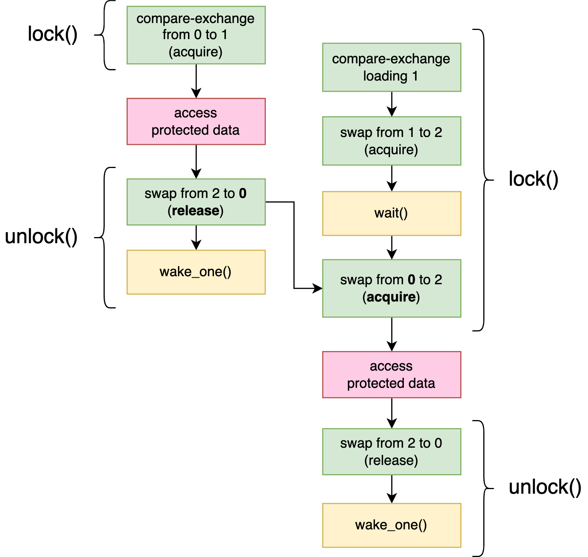

# 第九章：构建我们自己的「锁」

在该章节，我们将建造属于我们自己的互斥锁（`mutex`）[^3]、条件变量（`condition variable`）[^4]以及读写锁（`reader-writer lock`）[^5]。对于它们中的任何一个，我们都会从一个非常基础的版本开始，然后扩展它以使其更高效。

因为我们并不会使用来自标准库中的锁类型（因为这将是作弊行为），因此我们将不得不使用来自[第八章](./8_Operating_System_Primitives.md)的工具，才能够在不忙碌循环（`busy-looping`[^1]）的情况下使线程等待。然而，正如我们在该章节看到的，操作系统提供的可用工具因平台而异，因此很难去构建跨平台工作的东西。

幸运地是，更多现代化操作系统都支持类似 `futex` 的功能，或者至少支持唤醒（`wake`）和等待（`wait`）操作。正如我们在[第八章](./8_Operating_System_Primitives.md)看到的，Linux 自从 2003 年就一直支持 futex 系统调用，Winodws 自从 2012 年就支持 `WaitOnAddress` 系列功能，FreeBSD 自从 2016 年就将 `_umtx_op` 作为系统调用的一部分，等等。

最让人意外的是 macOS。尽管它的内核支持这些操作，但是它并没有暴露任意稳定、公共的 C 函数给我们使用。然而，macOS 附带了一个最新版本的 `libc++`（这是一个 C++ 标准库的实现）。该标准库包含对 C++20 的支持，该版本内置了非常基础对原子等待和唤醒操作（像 `std::atomic<T>::wait()`）。尽管由于各种原因，Rust 利用这些还非常的棘手，然而，这当然是可能的，这也可以让我们在 macOS 上访问基本的像 futex 的等待和唤醒功能。

我们将不再深入研究哪些复杂的细节，而是选择利用 `crates.io` 的 `atomic-wait` crate，为我们的「锁」原语提供基础的构建模块。该 crate 提供了三个函数：`wait()`、`wake_one()` 以及 `wake_all()`。它使用我们上面讨论的特定于平台规范的实现，为所有主要的平台实现了这些功能。这意味着我们只要坚持使用这三个函数，我们不再需要考虑任何平台的特定细节。

这些函数的行为就像我们在 Linux [第八章中的“Futex”](./8_Operating_System_Primitives.md#Futex)中实现的同名函数一样，不过让我们快速回顾一下如何工作的。

* *wait(&AtomicU32, u32)*

  该函数用于等待直到原子变量不再包含给定的值。如果原子变量中存储的值等于给定值，它将阻塞。当另一个线程修改了原子变量的值，该线程需要在统一原子变量上调用以下的任意一个唤醒函数，以将等待的线程从睡眠中唤醒。

  该函数可能没有对应的唤醒操作，从而虚假地返回。因此，请确保在原子变量返回后检查其值，并在必要时重复 `wait()`。

* *wake_one(&AtomicU32)*
  
  该函数将唤醒单个线程，其是当前在相同原子变量上通过 `wait()` 方法阻塞的线程。在修改原子变量后，立即使用它，以通知一个正在等待的线程该原子变量发生了变化。

* *wake_all(&AtomicU32)*

  该函数将唤醒所有线程，其是当前在相同原子变量上通过 `wait()` 方法阻塞的线程。在修改原子变量后，立即使用它，以通知正在等待的线程该原子变量发生了变化。

仅支持 32 位原子，因为在所有主要平台这是唯一受支持的大小。

> 在[第八章中的“Futex”](./8_Operating_System_Primitives.md#Futex)，我们讨论了一个最小示例，以展示这些函数在实践中是如何使用的。如果你已经忘记，请务必在继续之前查看该示例。

为了使用 atomic-wait crate，在你的 `Cargo.toml` 中增加 `atomic-wait="1"` 到 `[dependencies]`；或者运行 `cargo add atomic-wait@1`，这样也同样位你做到这点。这三个函数在 crate 的根中定义，你可以使用 `atomic_wait::{wait, wake_one, wake_all};` 导入它们。

> 当你阅读到这篇文章时，该 crate 可能有后续的可用版本，但该章节进使用主版本为 1 的构建。后续的版本可能有不兼容的接口。

现在，我们已经有基础的知识，让我们开始吧。

## Mutex

在构建 `Mutex<T>` 时，我们将采用来自[第四章](./4_Building_Our_Own_Spin_Lock.md)的 `SpinLock<T>` 类型。在不涉及阻塞的部分，例如守护类型的设计，将保持不变。

让我们从类型定义开始。与自旋锁相比，我们必须做一个更改：而不是将 `AtomicBool` 设置为 `false` 或者 `true`，我们将使用 `AtomicU32`，将其设为 0 或者 1，所以我们可以将其与原子等待和唤醒函数一起使用。

```rust
pub struct Mutex<T> {
    /// 0: unlocked
    /// 1: locked
    state: AtomicU32,
    value: UnsafeCell<T>,
}
```

就像是自旋锁一样，我们也需要承诺 `Mutex<T>` 也可以在线程之间共享，即使它包含一个可怕的 `UnsafeCell`：

我们将增加一个 `MutexGuard` 类型，该类型实现了 `Deref` trait，以提供一个完全安全的锁接口，就像我们在[第四章：使用锁守卫的安全接口](./4_Building_Our_Own_Spin_Lock.md#使用锁守卫的安全接口)：

```rust
pub struct MutexGuard<'a, T> {
    mutex: &'a Mutex<T>,
}

impl<T> Deref for MutexGuard<'_, T> {
    type Target = T;
    fn deref(&self) -> &T {
        unsafe { &*self.mutex.value.get() }
    }
}

impl<T> DerefMut for MutexGuard<'_, T> {
    fn deref_mut(&mut self) -> &mut T {
        unsafe { &mut *self.mutex.value.get() }
    }
}
```

> 对于锁守卫类型的设计和操作，参见[第四章：使用锁守卫的安全接口](./4_Building_Our_Own_Spin_Lock.md#使用锁守卫的安全接口)。

在我们进入有趣的部分之前，让我们也将 `Mutex::new` 函数拿出来。

```rust
impl<T> Mutex<T> {
    pub const fn new(value: T) -> Self {
        Self {
            state: AtomicU32::new(0), // unlocked state
            value: UnsafeCell::new(value),
        }
    }

    //…
}
```

现在，我们已经完成了，然而还有剩下的两块未完成：锁定（`Mutex::lock()`）和释放（为 `MutexGuard<T>` 的 `Drop`）。

我们为自旋锁实现的锁（lock）函数，使用了一个原子交换（`swap`）操作以试图去获取锁，如果它成功的将状态从“解锁”更改到“锁定”，则返回。如果未成功，它将立刻再次尝试。

为了锁住我们的 mutex，我们将做几乎相同的操作，除了在再次尝试之前，我们会使用 `wait()` 等待：

```rust
    pub fn lock(&self) -> MutexGuard<T> {
        // Set the state to 1: locked.
        while self.state.swap(1, Acquire) == 1 {
            // If it was already locked..
            // .. wait, unless the state is no longer 1.
            wait(&self.state, 1);
        }
        MutexGuard { mutex: self }
    }
```

> 对于内存排序，与我们的自旋锁相同。对于该细节，可以参考：[第四章](https://marabos.nl/atomics/building-spinlock.html)。

注意，仅有在我们调用它时，状态仍设置为 1（锁定）时，`wait()` 函数才会阻塞，这样我们就不必担心在交换和等待调用之间失去唤醒调用的可能性。

守卫类型的 Drop 实现是负责释放 mutex。释放我们的自旋锁是简单的：仅需要设置状态到 false（释放锁）。然而，对于我们的互斥体来说，这还不够。如果有一个线程等待锁定 mutex，除非我们使用唤醒操作通知它，否则它不会知道 mutex 已经被释放。如果我们不唤醒它，它将更可能永远保持睡眠。（也许它很幸运，在正确的时间被虚假地唤醒（spurious wake-up）[^2]，但是我们不要指望这一点。）

因此，我们不仅将状态设置回 0（释放），而且还会在之后立即调用 `wake_one()`：

```rust
impl<T> Drop for MutexGuard<'_, T> {
    fn drop(&mut self) {
        // Set the state back to 0: unlocked.
        self.mutex.state.store(0, Release);
        // Wake up one of the waiting threads, if any.
        wake_one(&self.mutex.state);
    }
}
```

唤醒一个线程就足够了，因为即使有多个线程在等待，也仅有其中的一个线程能够认领锁。锁定它的下一个线程将在锁定完成后唤醒另一个线程，以此类推。同时唤醒多个线程，只会让这些线程感到不满，浪费宝贵的处理器时间，因为其中除了一个幸运的线程能够获取锁，其它线程都会意识到自己失去机会后，从而再次进入休眠状态。

注意，不能保证我们唤醒的每一个线程都能抓住锁。另一个线程可能仍然在它有机会之前立刻抓住锁。

这里做出的一个重要的观察是，如果没有等待和唤醒功能，这个 mutex 的实现在技术上仍然是正确的（即内存安全）。因为 `wait()` 操作可以虚假地唤醒，我们无法对他何时返回作出任何假设。我们仍然得去管理我们锁定原语的状态。如果我们移除等待和唤醒函数调用，我们的 mutex 将与我们的自旋锁状态基本相同。

一般来说，从内存安全方面，原子等待和唤醒函数从不会影响正确性。它们仅是一个（非常重要的）优化，以避免忙碌循环。这并不意味着由任何实际标准都无法使用的低效锁将是“正确的”，但是尝试去推理关于不安全的 Rust 代码时，这种见解可能是有帮助的。

<div style="border:medium solid green; color:green;">
  <h2 style="text-align: center;">Lock API</h2>
  如果你正在计划将实现 Rust 锁当作一个新的爱好，那么你可能很快对涉及提供安全接口的样板代码感到厌烦。也就是说，UnsafeCell、Sync 实现、守护类型、Deref 实现等等。

  crate.io 上的 `lock_api` 可以自动地去处理这些事情。你仅需要制作一个锁定状态的类型，并通过（不安全）`lock_api::RawMutex` trait 提供（不安全）锁定和释放功能。`lock_api::Mutex` 类型将根据你的锁实现，提供一个完全安全的和符合人体工学的 mutex 类型作为返回，包括 mutex 守护。
</div>

### 避免系统调用

到目前为止，我们 mutex 中最慢的部分是等待和唤醒，因为这（可能）导致一个*系统调用*，即对操作系统内核的调用。像这样与内核交互是一个相当复杂的过程，往往相当缓慢，尤其是与原子操作比较。因此，对于一个高性能 mutex 的实现，我们应该尽可能尝试去避免等待和唤醒调用。

幸运地是，我们已经走了一半。因为在 `wait()` 调用之前，我们的锁定函数 `while` 循环才会检查状态，因此在 mutex 未锁定的情况下，等待操作在这种情况下将完全地跳过，我们并不需要等待。然而，我们在解锁时，会无条件地调用 `wake_one()` 函数。

如果我们知道没有其它线程在等待，我们可以跳过 `wake_one()`。为了知道是否有等待线程，我们需要自己跟踪这些信息。

我们可以通过将“锁定”状态分割成两个单独的状态来完成这一点：“没有等待者的锁定”和“有等待者的锁定”。我们将使用值 1 和 2 做这些，并更新我们文档中结构体定义中的状态字段的注释。

```rust
pub struct Mutex<T> {
    /// 0: unlocked
    /// 1: locked, no other threads waiting
    /// 2: locked, other threads waiting
    state: AtomicU32,
    value: UnsafeCell<T>,
}
```

现在，对于一个释放的 mutex，我们的 lock 函数仍然需要将状态设置为 1 才能锁定它。然而，如果它已经锁定，我们的 lock 函数需要在睡眠之前将状态设置为 2，以便释放（unlock）函数可以判断这有一个等待线程。

为了做到这一点，我们首先使用 `compare-and-exchange` 函数，试图改变状态从 0 到 1。如果成功，我们就已经锁定了 mutex，并且我们知道，这没有其它的等待者，因为 mutex 之前没有锁定。如果它失败了，那一定是因为 mutex 当前被锁定（在状态 1 或 2）。在这种情况下，我们将使用一个原子交换操作将其设置为 2。如果交换操作返回 1 或 2 的旧值，那这意味着 mutex 事实上仍然被锁定，并且仅有这样，我们才会使用 `wait()` 去阻塞，直到它改变。如果交换操作返回 0，这意味着我们通过改变它的状态从 0 到 2 已经成功锁定 mutex。

```rust
    pub fn lock(&self) -> MutexGuard<T> {
        if self.state.compare_exchange(0, 1, Acquire, Relaxed).is_err() {
            while self.state.swap(2, Acquire) != 0 {
                wait(&self.state, 2);
            }
        }
        MutexGuard { mutex: self }
    }
```

现在，我们释放功能可以在必要时通过跳过 `wake_one()` 调用来利用新信息。我们现在使用交换操作，而不是仅仅存储一个 0 去释放 mutex，这样我们就可以检查它之前的值。仅当值为 2 时，我们将继续唤醒一个线程：

```rust
impl<T> Drop for MutexGuard<'_, T> {
    fn drop(&mut self) {
        if self.mutex.state.swap(0, Release) == 2 {
            wake_one(&self.mutex.state);
        }
    }
}
```

注意，将状态设置回 0 后，它不再指示是否有任何其它的等待线程。唤醒的线程负责将状态设置为 2，以确保没有任何其它的线程忘记。这是为什么在我们的锁定功能中「比较和交换」（`compare-and-exchange`）操作不是我们 while 循环的一部分。

这确实以为这，每当线程在锁定时不得不 `wait()`，当释放时，它将也调用 `wake_one()`。然而，更重要的是，*在未考虑的情况下*，线程不试图获取锁的理想状况下，完全地避免了 `wait()` 和 `wake_one()` 调用。

图 9-1 展示了两个线程同时尝试锁定我们的 mutex 操作的情况下的 happens-before 关系。首先线程通过改变状态从 0 到 1 锁定 mutex。此时，第二个线程将无法获取锁，并且在改变状态从 1 到 2 后进入睡眠。当第一个线程释放 mutex 时，它会交换状态回 0。因为是 2，表示一个等待线程，它调用 `wake_one()` 来唤醒第二个线程。注意，我们不能依赖于唤醒和等待操作之间的任何 happens-before 关系。虽然唤醒操作可能是负责唤醒等待线程的操作，但 happens-before 关系是通过 `acquire` 交换操作建立的，观察 `release` 交换操作存储的值。


*图 9-1。两个线程之间 happens-before 的关系同时试图锁定我们的 mutex。*

### 进一步优化

在这一点上，我们似乎没有什么可以进一步优化的了。在未考虑的情况下，我们执行零系统调用，并且剩下的只是两个非常简单的原子操作。

避免等待和唤醒操作的唯一方式是回到我们的旋转锁实现。尽管自旋通常是非常低效的，但它至少避免了系统调用的潜在开销。唯一能提高自旋效率的情况是等待时间很短的情况下。

对于锁定一个 mutex，这仅在当前持有锁的线程在不同的处理器内核上并行运行，并且非常短暂地保留锁定的情况下发生。然而，这是一个非常常见的案例。

我们可以尝试将两种方法的优点结合起来，在调用 `wait()` 之前进行非常短暂的自旋。这样，如果锁被很快释放，我们根本不需要调用 `wait()`，但我们仍然避免了消耗其它线程更好利用的不合理的处理器时间。

实现这个仅需要改变我们的锁定功能。

为了在未考虑的情况下尽可能保持性能，我们将在锁定功能开始时保留原始的 `compare-and-exchange` 操作。我们将使自旋等待作为一个单独的功能。

```rust
impl<T> Mutex<T> {
    //…

    pub fn lock(&self) -> MutexGuard<T> {
        if self.state.compare_exchange(0, 1, Acquire, Relaxed).is_err() {
            // The lock was already locked. :(
            lock_contended(&self.state);
        }
        MutexGuard { mutex: self }
    }
}

fn lock_contended(state: &AtomicU32) {
    //…
}
```

在 `lock_contended` 中，在继续等待循环之前，我们可能简单地重复相同的 `compare-and0-exchange` 操作几百次。然而，一个 `compare-and-exchange` 操作通常尝试去获取相关缓存行（cache line）的独占访问（[第七章 MESI 协议](./7_Understanding_the_Processor.md#mesi-协议)），当重复执行时，这可能比简单的加载操作更昂贵。

考虑到这一点，我们来到了以下 `lock_contented` 的实现：

```rust
fn lock_contended(state: &AtomicU32) {
    let mut spin_count = 0;

    while state.load(Relaxed) == 1 && spin_count < 100 {
        spin_count += 1;
        std::hint::spin_loop();
    }

    if state.compare_exchange(0, 1, Acquire, Relaxed).is_ok() {
        return;
    }

    while state.swap(2, Acquire) != 0 {
        wait(state, 2);
    }
}
```

首先，我们自旋到 100 次，这是我们像在[第四章](./4_Building_Our_Own_Spin_Lock.md)时使用 *`spin loop` 提示*。只要 mutex 没被锁定，并且没有等待者，我们就会自旋。如果另一个线程已经在等待，这意味着它放弃了自旋，因为它花费的时间太长，这可能表明自旋对这个线程也不是很有用。

> 一百个周期的自旋时间大多数是任意选择的。迭代锁花费的时间和系统调用期间（我们试图避免）很大程度上取决于平台。大范围的基础测试可以帮助我们选择一个正确的数字，但是不幸地是，没有一个准确的回答。
>
>Rust 标准库的 `std::sync::Mutex` 的 Linux 实现，至少是 Rust 1.66.0，使用至少是 100 次的自旋计数。

锁定状态改变后，我们再次尝试将其设定为 1 来锁定它，然后我们再放弃并且开始自旋等待。正如我们之前讨论的，我们调用 `wait()` 后，我们不能在通过设定它的状态到 1 来锁定 mutex，因为这可能导致其它的等待者被忘记。

<div style="border:medium solid green; color:green;">
  <h2 style="text-align: center;">Cold 和 Inline 属性</h2>
  你可以增加 `#[cold]` 属性到 `lock_contented` 函数定义，以帮助编译器理解在常见（未考虑）情况下不调用这个函数，这对 lock 方法的优化有帮助。

  额外地，你也可以增加 `#[inline]` 属性到 Mutex 和 MutexGuard 方法，以通知编译器将其内联可能是一个好主意：将生成的指令将其放置在调用方法的地方。一般来说，是否能提高性能很难说，但对于这些非常小的功能，通常如此。
</div>

### 基准测试

测试 mutex 实现的性能是很难的。写基准测试和得到一些数字很容易，但是很难去得到一些有意义的数字。

优化 mutex 的实现以在特定基准测试表现良好是相对容易的，但这并没有很有用。毕竟，关键是去做一些在真实世界良好的东西，而不仅是测试程序。

我们将试图去写两个简单的基础测试，表明我们的优化至少对一些用例产生了一些积极影响，但请注意，任何结论在不同场景都不一定成立。

在我们的第一次测试中，我们将创建一个 Mutex 并锁定和释放它几百万次，所有都在同一线程上，以测量它花费总的时间。这是对琐碎未讨论场景的测试，其中从来没有任何需要唤醒的线程。希望这将向我们展示 2-state 和 3-state 版本的差异。

```rust
fn main() {
    let m = Mutex::new(0);
    std::hint::black_box(&m);
    let start = Instant::now();
    for _ in 0..5_000_000 {
        *m.lock() += 1;
    }
    let duration = start.elapsed();
    println!("locked {} times in {:?}", *m.lock(), duration);
}
```

> 我们使用 `std::hint::black_box`（像我们在[第七章“对性能的影响”](./7_Understanding_the_Processor.md#对性能的影响)）去强制编译器假设有更多的代码去访问 mutex，阻止它优化循环或者锁定操作。

结果因硬件和操作系统不同而不同。在一台配备最新 AMD 处理器的特定 Linux 计算机上尝试，对于我们为优化的 2-state mutex 花费时间大约 400ms，对于我们优化过后的 3-state mutex 大约 40ms。一个因素获得十倍的性能提升！在另一个有着老式 Intel 处理器 Linux 计算机中，差异甚至更大：大约 1800ms 比上 60ms。这证实了，第三个状态的加入确实是一个非常大的优化。

然而，在 macOS 上运行，这回产生一个完全不同的结果：这两个版本大约都是 50ms，这展示了非常高的平台依赖。

事实证明，我们在 macOS 上使用的 libc++ 的 `std::atomic<T>::wake()` 实现，已经进行了自己的内部管理，独立于内核，以避免不必要的系统调用。Windows 上的 `WakeByAddressSingle()` 也是如此。

避免调用这些函数仍然可能带来稍微更好的性能，因为它们的实现并非是微不足道的，尤其因为它们并不能在原子变量本身中存储任何信息。然而，如果我们的目标仅针对这些操作系统，我们将质疑在我们的 mutex 中增加第三个状态是否是值得的。

为了看看我们的自旋优化是否有任何积极的影响，我们需要一个不同的基准测试：一个有着大量争用的测试，多个线程反复尝试去锁定一个已经上锁的 mutex。

让我们尝试一个场景，四个线程都尝试锁定和释放 mutex 上万次：

```rust
fn main() {
    let m = Mutex::new(0);
    std::hint::black_box(&m);
    let start = Instant::now();
    thread::scope(|s| {
        for _ in 0..4 {
            s.spawn(|| {
                for _ in 0..5_000_000 {
                    *m.lock() += 1;
                }
            });
        }
    });
    let duration = start.elapsed();
    println!("locked {} times in {:?}", *m.lock(), duration);
}
```

注意，这是一个极端和不切实际的场景。mutex 仅能保留一个极短的时间（进去增加一个整数），并且在释放后，线程将立刻试图再次锁定 mutex。不同的场景将导致非常不同的结果。

让我们像以前一样，在两台相同的 Linux 计算机上运行基准测试。在那台较旧的 Intel 处理器的计算机上，不使用自旋版本大约需要 900ms，而使用自旋版本大约需要 750ms。这是一个改进。而在那台新的 AMD 处理器计算机上，我们得到一个相反的结果：不使用自旋大约 650ms，而使用自旋大约需要 800ms。

总之，不幸的是，关于自旋是否真正提高性能的答案是“这取决于平台等”，即使只看一个场景。

## 条件变量

让我们做一些更有趣的事情：实现一个条件变量。

正如我们在[第一章“条件变量”](./1_Basic_of_Rust_Concurrency.md#条件变量)中见到的，条件变量与 mutex 一起使用，以等待受 mutex 保护的数据与某些条件匹配。它有一个等待方法释放 mutex，等待一个信号，并再次锁定相同的 mutex。通常由其它线程发送信号，在修改 mutex 保护的数据后立即发送给一个等待的线程（通常叫做“通知一个”或“单播”）或者通知所有等待的线程（通常叫做“通知所有”或“广播”）。

虽然条件变量试图让等待线程保持睡眠状态，直到它发出一个信号，但等待线程可能没有相应信号的情况下被虚假地唤醒。然而，条件变量的等待操作将仍然是在返回之前重新锁定 mutex。

注意，此接口与我们的类 futex `wait()`、`wake_one()` 以及 `wake_all()` 几乎相同。主要的不同是在于防止信号丢失的机制。条件变量在释放 mutex 之前开始“监听”信号，以便不错过任何信号，而我们的 futex 风格的 `wait()` 函数依赖于原子变量状态的检查，以确保等待仍然是一个好的方式。

这导致了条件变量以下最小实现的想法：如果我们确保每个通知都更改原子变量（例如计数器），那么我们的 `Condvar::wait()` 方法需要做的就是在释放 mutex 之前，检查该变量的值，并且在释放它之后，传递它到 futex 风格的 `wait()` 函数。这样，如果自释放 mutex 以来，收到任意通知信号，它将不再睡眠。

我们试试吧！

我们开始从 Condaver 结构体开始，该结构体仅包含单个 AtomicU32，我们用 0 初始化：

```rust
pub struct Condvar {
    counter: AtomicU32,
}

impl Condvar {
    pub const fn new() -> Self {
        Self { counter: AtomicU32::new(0) }
    }

    //…
}
```

通知方法是简单的。它们仅需要改变 counter 以及使用相应的唤醒操作去通知任意的等待线程：

```rust
    pub fn notify_one(&self) {
        self.counter.fetch_add(1, Relaxed);
        wake_one(&self.counter);
    }

    pub fn notify_all(&self) {
        self.counter.fetch_add(1, Relaxed);
        wake_all(&self.counter);
    }
```

（稍后我们会讨论内存排序）

等待方法将采用 `MutexGuard` 作为参数，因为它表示已锁定 mutex 的证明。它将也返回 `MutexGuard`，因为它要确保在返回之前，再次锁定 mutex。

正如我们之前概述的那样，该方法将首先检查 counter 当前的值，然后再释放 mutex。释放 mutex 之后，如果 counter 仍未改变，它将继续等待，以确保我们不会失去任意信号。一下是作为代码的样子：

```rust
   pub fn wait<'a, T>(&self, guard: MutexGuard<'a, T>) -> MutexGuard<'a, T> {
        let counter_value = self.counter.load(Relaxed);

        // Unlock the mutex by dropping the guard,
        // but remember the mutex so we can lock it again later.
        let mutex = guard.mutex;
        drop(guard);

        // Wait, but only if the counter hasn't changed since unlocking.
        wait(&self.counter, counter_value);

        mutex.lock()
    }
```

> 这里用了 MutexGuard 的私有 mutex 字段。Rust 中的私有性是基于模块的，所以如果你正在与 MutexGuard 不同的模块定义这个，则需要将 MutexGuard 的 mutex 字段标记如下，例如，`pub(crate)` 使其在 crate 中的其它模块可见。

在我们成功的完成我们的条件变量之前，让我们开始考虑一下内存排序。

当 mutex 锁定时，没有其它线程可以改变受保护的 mutex 数据。因此，我们并不需要担心来自我们释放 mutex 之前的通知，因为只要我们保持 mutex 锁定，数据就不会发生任何变化，这会让我们改变关于想要睡眠和等待的想法。

我们唯一感兴趣的情况是，我们释放 mutex 后，另一个线程出现并且锁定 mutex，改变受保护的数据，并且向我们发出信号（希望在释放 mutex 之后）。

在这种情况下，在 `Condvar::wait()` 释放 mutex 和在通知线程中锁定 mutex 之间有一个 happens-before 关系。该关系是确保我们的 Relaxed 加载（在解锁之前发生）会观察到通知的 Relaxed 加 1 操作（在锁定之后发生）之前的值。

我们并不知道 `wait()` 操作是否会在加 1 之前或者之后看到值，因为此时没有任何东西可以保证排序。然而，这并不重要，因为 `wait()` 在相应的唤醒操作中具有原子性行为。要么它看见新值，在这种情况下，它根本不会进入睡眠，或者它看见旧值，在这种情况下，它会进入睡眠，并由来自通知中相应的 `wake_one()` 或者 `wake_all()` 唤醒。

图 9-2 展示了操作和 happens-before 关系，在这种情况下，一个线程使用 `Condvar::wait()` 等待一些受 mutex 保护的数据更改，并由第二个线程唤醒，该线程修改数据并且调用 `Condvar::wake_one()`。注意，由于释放和锁定操作，第一次加载操作能够保证观察到递增之前到值。


*图 9-2。一个线程使用 `Condvar::wait()` 被另一个使用 `Condvar::notify_one()` 的线程唤醒的操作和 happens-before 的关系。*

我们应该也考虑如果 conter 溢出会发生什么。

只要每次通知之后计数器是不同的，它的真实值就无关紧要。不幸的是，在超过 40 亿个通知之后，计数器将溢出，并以 0 重新启动，回到之前使用过的值。从技术上讲，我们的 `Condvar::wait()` 实现可能在不应该的时候进入睡眠状态：如果它正好错过了 4,292,967,296 条通知（或者任意它的倍数），它会溢出计数器，直到它之前拥有的值。

认为这种情况发生的可能性可以忽略不计是完全合理的。与我们在 mutex 锁定方法所做的不同，我们不会在这里唤醒后，重新检查状态和重复和重复 `wait()` 调用，所以我们仅需要关心在 counter 的 relaxed 加载操作和 `wait()` 调用之间的那一刻发生溢出往返（round-trip）。如果一个线程中断太久，以至于（确切地）允许发生许多通知，那么可能已经出现大问题，并且程序已经变得没有响应。此时，人们可能会合理地争辩到：线程保持睡眠的微观额外风险不再重要。

>在支持有时间限制的 futex 式等待的平台上，可以使用几秒钟的等待操作使用超时来降低溢出的风险。发送 40 亿条通知将花费更长的时间，此时，额外的几秒钟的风险将产生非常小的影响。这完全消除了由于等待线程错误地一直待在睡眠状态而导致程序锁定的的任何风险。

让我们看看它是否工作！

```rust
#[test]
fn test_condvar() {
    let mutex = Mutex::new(0);
    let condvar = Condvar::new();

    let mut wakeups = 0;

    thread::scope(|s| {
        s.spawn(|| {
            thread::sleep(Duration::from_secs(1));
            *mutex.lock() = 123;
            condvar.notify_one();
        });

        let mut m = mutex.lock();
        while *m < 100 {
            m = condvar.wait(m);
            wakeups += 1;
        }

        assert_eq!(*m, 123);
    });

    // Check that the main thread actually did wait (not busy-loop),
    // while still allowing for a few spurious wake ups.
    assert!(wakeups < 10);
}
```

我们计算条件变量从它的 wait 方法返回的次数，以确保它实际上进入了的睡眠。如果它返回的数值非常大，那就表明我们不小心自旋了。重要的是测试这个，因为从未睡眠的条件变量仍然会导致“正确的”行为，但会有效地将等待循环变成一个自旋循环。

如果我们运行这个测试，我们会看到它编译并顺利通过，确认我们的条件变量确实将我们的主线程置于睡眠状态。当然，这并不能证明它的实现是正确的。如果有必要，可以使用涉及多个线程的长时间压力测试，理想情况下，在弱序处理器架构的计算机上运行，以获得更多信心。

### 避免系统调用2

正如我们在[“Mutex：避免系统调用”](#避免系统调用)中的那样，优化一个锁定原语主要是避免不需要的等待和唤醒操作。

就我们的条件变量而言，在我们的 `Condvar::wait()` 实现中尝试避免 `wait()` 调用没有多大用处。当线程决定条件变量时，它已经检查了它正在等待的事情还没有发生，并且它需要进入睡眠。如果不需要等待，它根本就不用调用 `Condvar::wait()`。

然而，我们可以避免调用 `wake_one()` 和 `wake_all()` 调用，就像我们为 Mutex 所做的那样。

一个简单的方式是去保持跟踪正在等待线程的数量。我们的等待方法需要在等待之前递增，并且在完成的时候递减。然后如果跟踪的数值是 0，通知方法会跳过发送它们的信号。

所以，我们增加了一个新的字段到我们的 `Condvar` 结构体，以跟踪激活的等待者的数量：

```rust
pub struct Condvar {
    counter: AtomicU32,
    num_waiters: AtomicUsize, // New!
}

impl Condvar {
    pub const fn new() -> Self {
        Self {
            counter: AtomicU32::new(0),
            num_waiters: AtomicUsize::new(0), // New!
        }
    }

    //…
}
```

通过将 AtomicUsize 用于 num_waiters，我们不必要担心它溢出。usize 是足够大的，能够计算内存中的每个字节，所以如果我们假设每个激活的线程占用至少内存的一个字节，它是绝对的足够大，能够计算任意数量的并发的存在线程。

下一步，我们更新我们的通知功能，如果没有等待线程，则什么也不做：

```rust
    pub fn notify_one(&self) {
        if self.num_waiters.load(Relaxed) > 0 { // New!
            self.counter.fetch_add(1, Relaxed);
            wake_one(&self.counter);
        }
    }

    pub fn notify_all(&self) {
        if self.num_waiters.load(Relaxed) > 0 { // New!
            self.counter.fetch_add(1, Relaxed);
            wake_all(&self.counter);
        }
    }
```

（我们稍后会讨论内存排序）。

最后，最重要的是，我们在等待方法开始时增加它，并在它唤醒后立即减少：

```rust
    pub fn wait<'a, T>(&self, guard: MutexGuard<'a, T>) -> MutexGuard<'a, T> {
        self.num_waiters.fetch_add(1, Relaxed); // New!

        let counter_value = self.counter.load(Relaxed);

        let mutex = guard.mutex;
        drop(guard);

        wait(&self.counter, counter_value);

        self.num_waiters.fetch_sub(1, Relaxed); // New!

        mutex.lock()
    }
```

我们应该再次仔细询问我们自己，对于所有这些原子操作，Relaxed 内存排序是否应该足够。

我们引入的一个新的潜在风险是，通知方法在 num_waiters 中观察到 0，跳过了它的唤醒操作，实际上却有一个线程需要唤醒。这种情况可能当通知方法在递增操作之前或者递减操作之后观察到值时发生。

就像从 counter 中的 relaxed 加载操作一样，事实上，在递增 num_waiters 时，等待者将仍然持有 mutex，这确保了在释放 mutex 之后发生的任何 num_waiters 加载操作都不会看到它被递增之前的值。

我们也不需要担心通知线程观察到递减值“太快”，因为一旦执行递减操作，或许在虚假唤醒之后，等待线程不再需要被唤醒。

换句话说，mutex 建立的 happens-before 关系仍然提供了我们需要的所有保证。

### 避免虚假唤醒

另一个方式是通过避免虚假唤醒来优化我们的条件变量。每次线程被唤醒时，它将尝试锁定 mutex，这可能与其它线程产生竞争，这可能在性能上有一个巨大的影响。

底层 `wait()` 操作偶尔会虚假唤醒是很罕见的，但是我们的条件变量实现很容易使得 `notify_one()` 导致不止一个线程去停止等待。如果一个线程正在进入睡眠的过程，刚刚加载了 counter 的值，但是仍然没有进入睡眠，那么调用 `notify_one()` 将由于更新的 counter 从而阻止线程进入睡眠状态，但也会因为后续的 `wake_one()` 操作导致第二个线程唤醒。这两个线程将先后竞争 mutex，浪费宝贵的处理器时间。

这听起来像是一个罕见的现象，但是由于 mutex 最终如何同步线程是未知的，这实际上很容易发生。在条件变量上调用 `notify_one()` 的线程最有可能在此之前立即锁定和释放 mutex，以改变等待线程正在等待的数据的某些内容。这意味着，一旦 `Condvar::wait()` 方法释放了 mutex，那就有可能立刻解除了正在等待 mutex 的通知线程的阻塞。此刻，这两个线程正在竞争：等待线程正在进入睡眠，通知线程正在锁定和释放 mutex 并且通知条件变量。如果通知线程赢得竞争，等待线程将由于 counter 递增而不会进入睡眠，但是通知线程仍然调用 `wake_one()`。这正是上面描述的问题情况，它可能会不必要地唤醒一个额外线程。

一个相对简单的解决方案是跟踪允许唤醒的线程数量（即从 `Condvar::wait()` 返回）。`notify_one()` 方法会将其增加 1，并且如果它不是 0，等待方法会试图将其减少 1。如果 counter 是 0，它可以进入（返回）睡眠状态，而不是试图重新锁定 mutex 并且返回。（通知添加另一个专门用于 `notify_all` 的计数器来通知所有线程来完成，该 counter 永远不会减少。）

这种方式是有效的，但是有一个新的并且更微妙的问题：通知可能唤醒一个甚至仍没有调用 `Condvar::wait()` 的线程，包括它自身。调用 `Condvar::notify_one()` 将增加应该唤醒的线程数量，并且使用 `wake_one()` 去唤醒一个等待线程。然而，如果另一个（甚至相同的）线程在已经等待的线程有机会唤醒之前调用 `Condvar::wait()`，新等待的线程可以看到一个通知待处理，并通过将 counter 减少到 0 来声明它，并立即返回。正在等待的第一个线程将返回睡眠状态，因为另一个线程已经获取了一个通知。

根据用例，这可能完全没有问题，或者有大问题，导致一些线程从未取得进展。

> GNU libc 的 `pthread_cond_t` 的实现曾经受到这个问题影响。后来，经过大量关于 POSIX 规范是否允许的讨论，这个问题最后随着 2017 的 GNU libc 2.25 的发布而最终解决，这包含一个全新的条件变量实现。

在很多使用条件变量的情况下，等待线程会抢走一个更早的通知。然而，当为一般类型而不是特定用例的类型实现条件变量时，该行为可能是不可接受的。

同样，我们必须得出结论，我们是否应该使用一个优化方式的答案是，不出意外的是，“这取决于平台等”。

> 有一些方法去比变这个问题，同时仍然比main虚假唤醒，但这些方法要比其它方法复杂得多。
>
> GNU libc 的新条件变量解决方案包括将等待线程分为两组，仅允许第一组去消费通知，并在第一组没有等待线程时交换组。
>
>这种算法的一个缺点是，不仅是算法的复杂性，同时也显著增加条件变量类型的大小，因为它现在需要跟踪更多的信息。

<div style="border:medium solid green; color:green;">
  <h2 style="text-align: center;">惊群问题（Thundering Herd Problem）</h2>
  当使用 notify_one() 唤醒正在等待很多相同事情的线程时，当使用条件变量时可能遇到的高性能问题。

  问题是，在唤醒后，所有这些线程都将立即尝试锁定相同的 mutex。更可能地是，仅有一个线程将成功，并且所有其它线程都将回到睡眠状态。很多线程都急于宣称相同资源的资源浪费问题被称为<i>惊群问题</i>。

  认为 Condvar::notify_all() 是从根本上不值得优化的反模式不是没有原因的。条件变量的目的是去释放 mutex 并且当接受通知时重新锁定它，因此也许一次通知多个线程从来不是任何好主意。

  甚至，如果我们想针对这种情况进行优化，我们可以在像 futex 这种支持<i>重新排队</i>操作的操作系统上，例如在 Linux 山的 FUTEX_REQUEUE（参见<a href="./8_Operating_System_Primitives.md">第八章“Futex 操作”</a>）

  与其唤醒许多线程，一旦它们意识到锁已经被占用，除一个线程外，其它线程都将立刻回到睡眠状态，我们可以<i>重新</i>排队除一个线程外的其它所有线程，以便它们的 futex 等待操作不再等待条件变量的 counter，而是开始等待 mutex 的状态。

  重新排队一个等待线程不会唤醒它。时上升，线程甚至不知道自己已经在重新排队。不幸地是，这可能导致一些非常细微的陷阱。

  例如，还记得 3 个状态的 mutex 总是在唤醒后必须锁定正确的状态（“有着等待线程的锁定”），以确保其它等待线程不会被遗忘？这意味着我们应该不在我们的 `Condvar::wait()` 实现中使用常规的 mutex 方法，这可能将 mutex 设置到一个错误的状态。

  一个重新排队的条件变量实现需要存储等待线程使用的 mutex 的指针。否则，通知线程将不知道等待线程重新排队到哪个原子变量（互斥体状态）。这就是为什么条件变量通常允许两个线程去等待不同的 mutex。尽管许多条件变量的实现并未利用重新排队，但未来版本可能利用此功能的可能性是有用的。
</div>

## 读写锁

是时候实现读写锁了。

回想一下，与互斥锁不同，读写锁支持两种类型的锁：读锁和写锁，有时称为共享锁定和排他性锁定。写锁的行为与锁定 mutex 相同，一次仅允许一个锁，而读锁则一次可以允许多个 reader 锁定。换句话说，它与 Rust 中的独占引用（`&mut T`）和共享引用（`&T`）密切相关，仅允许一个独占引用，或者任意数量的共享引用同时处于活动状态。

对于我们的 mutex，我们仅需要去跟踪它是否是锁定的。对于我们的读写锁，然而，我们也需要去知道当前持有多少个（读）锁，以确保所有写锁释放它们的锁后才会发生写锁。

让我们开始编写 `RwLock` 结构体，该结构体使用 AtomicU32 作为它的状态。我们将使用它去表示当前当前可获取的读锁数量，因此，值为 0 意味着它是未锁定的。为了表示写锁的 state，让我们使用一个特殊的值 `u32::MAX`。

```rust
pub struct RwLock<T> {
    /// The number of readers, or u32::MAX if write-locked.
    state: AtomicU32,
    value: UnsafeCell<T>,
}
```

对于我们的 `Mutex<T>`，我们必须限制它的同步实现，其类型 T 必须实现 `Send`，以确保它们不能将 `Rc` 发送到另一个线程。对于我们的新 `RwLock<T>`，我们还需要要求 T 也实现 `Sync`，因为多个 reader 将能够同时访问数据。

```rust
unsafe impl<T> Sync for Rwlock<T> where T: Send + Sync {}
```

因为我们的 RwLock 可以两种不同的方式锁定，我们将有两个单独的锁功能，每个都有属于自己的守卫：

```rust
impl<T> RwLock<T> {
    pub const fn new(value: T) -> Self {
        Self {
            state: AtomicU32::new(0), // Unlocked.
            value: UnsafeCell::new(value),
        }
    }

    pub fn read(&self) -> ReadGuard<T> {
        // …
    }

    pub fn write(&self) -> WriteGuard<T> {
        // …
    }
}

pub struct ReadGuard<'a, T> {
    rwlock: &'a RwLock<T>,
}

pub struct WriteGuard<'a, T> {
    rwlock: &'a RwLock<T>,
}
```

写守卫应该表现得像一个排他性引用（`&mut T`），我们通过为它实现 `Deref` 和 `DerefMut` 来实现这一点：

```rust
impl<T> Deref for WriteGuard<'_, T> {
    type Target = T;
    fn deref(&self) -> &T {
        unsafe {&*self.rwlock.value.get()}
    }
}

impl<T> DerefMut for WriteGuard<'_, T> {
    type Target = T;
    fn deref_mut(&mut self) -> &T {
        unsafe {&mut *self.rwlock.value.get()}
    }
}
```

然而，读守卫将仅实现 `Deref`，不用 `DerefMut`，因为它并不用独占数据的访问，这使它的行为像一个共享引用（`&T`）：

```rust
impl<T> Deref for ReadGuard<'_, T> {
    type Target = T;
    fn deref(&self) -> &T {
        unsafe { &*self.rwlock.value.get() }
    }
}
```

既然，我们已经摆出了样板代码，那让我们谈谈有趣的部分：锁定和释放。

为了读取锁定我们的 `RwLock`，我们必须将 state 递增，但是前提它必须还没有写锁定。我们将使用一个 `compare-and-exchange` 循环（[第二章“compare-and-exchange操作”](./2_Atomics.md#compare-and-exchange-操作)）去做这些。如果 state 是 `u32::MAX`，这意味着 RwLock 是写锁，我们将使用一个 `wait()` 操作去睡眠并且稍后重试。

```rust
    pub fn read(&self) -> ReadGuard<T> {
        let mut s = self.state.load(Relaxed);
        loop {
            if s < u32::MAX {
                assert!(s != u32::MAX - 1, "too many readers");
                match self.state.compare_exchange_weak(
                    s, s + 1, Acquire, Relaxed
                ) {
                    Ok(_) => return ReadGuard { rwlock: self },
                    Err(e) => s = e,
                }
            }
            if s == u32::MAX {
                wait(&self.state, u32::MAX);
                s = self.state.load(Relaxed);
            }
        }
    }
```

写锁定是简单的；我们仅需要改变 state 从 0 到 `u32::MAX`，或者如果它已经锁定则是 `wait()`：

```rust
    pub fn write(&self) -> WriteGuard<T> {
        while let Err(s) = self.state.compare_exchange(
            0, u32::MAX, Acquire, Relaxed
        ) {
            // Wait while already locked.
            wait(&self.state, s);
        }
        WriteGuard { rwlock: self }
    }
```

注意，锁定的 `RwLock` 确切 state 值是如何变化的，但是 `wait()` 操作希望我们给它一个确切的值去与 state 比较。这是为什么我们将来自 `compare-and-exchange` 操作的返回值用于 `wait()` 操作。

释放 reader 涉及到递减状态。最终释放 RwLock 的 reader，会将 state 从 1 改变到 0，负责唤醒等待的 writer（如果有的话）。

仅唤醒一个线程就足够了，因为我们知道目前没有任何正在等待的 reader。reader 根本没有理由正在等待一个读锁定的 RwLock。

```rust
impl<T> Drop for ReadGuard<'_, T> {
    fn drop(&mut self) {
        if self.rwlock.state.fetch_sub(1, Release) == 1 {
            // Wake up a waiting writer, if any.
            wake_one(&self.rwlock.state);
        }
    }
}
```

writer 必须重设 state 到 0 以释放，之后它应该唤醒一个等待的 writer 或者所有正在等待的 writer。

我们并不知道 reader 或者 writer 正在等待，我们也没有办法去唤醒一个 writer 或者只唤醒 reader。所以，我们只需要唤醒所有的线程：

```rust
impl<T> Drop for WriteGuard<'_, T> {
    fn drop(&mut self) {
        self.rwlock.state.store(0, Release);
        // Wake up all waiting readers and writers.
        wake_all(&self.rwlock.state);
    }
}
```

仅此而已！我们建立了一个非常简单但完全可用的读写锁。

是时候解决一些问题了。

### 避免 writer 忙碌循环

我们实现的一个问题是写锁可能导致意外地忙碌循环。

如果我们有一个很多 reader 重复锁定和释放的 RwLock，那么锁定状态可能会持续变化，重复上下波动。对于我们的 `write` 方法，这导致了在 `compare-and-exchange` 操作和随后的 `wait()` 操作之间发生锁定状态的变化可能很大，尤其 `wait()` 操作（相对缓慢地）作为系统调用直接实现。这意味着 `wait()` 操作将立即返回，即使锁从未释放；它只是 reader 数量与预期的不同。

解决方案是使用一个不同的 AtomicU32 让 waiter 去等待，并且仅有在我们真正想唤醒 writer 时，才改变原子的值。

让我们尝试这个，通过增加一个新的 `writer_wake_counter` 字段到我们的 RwLock：

```rust
pub struct RwLock<T> {
    /// The number of readers, or u32::MAX if write-locked.
    state: AtomicU32,
    /// Incremented to wake up writers.
    writer_wake_counter: AtomicU32, // New!
    value: UnsafeCell<T>,
}

impl<T> RwLock<T> {
    pub const fn new(value: T) -> Self {
        Self {
            state: AtomicU32::new(0),
            writer_wake_counter: AtomicU32::new(0), // New!
            value: UnsafeCell::new(value),
        }
    }

    // …
}
```

`read` 方法仍然保留未改变，但是 `write` 方法现在需要等待新的原子变量。为了确保我们在看到 RwLock 被读锁定和实际进入睡眠之间不失去任何通知，我们将使用类似于实现条件变量的模式：在检查我们是否仍然想要睡眠之前，检查 `writer_wake_counter`：

```rust
    pub fn write(&self) -> WriteGuard<T> {
        while self.state.compare_exchange(
            0, u32::MAX, Acquire, Relaxed
        ).is_err() {
            let w = self.writer_wake_counter.load(Acquire);
            if self.state.load(Relaxed) != 0 {
                // Wait if the RwLock is still locked, but only if
                // there have been no wake signals since we checked.
                wait(&self.writer_wake_counter, w);
            }
        }
        WriteGuard { rwlock: self }
    }
```

writer_wake_counter 的 `Acquire` 加载操作将与 `Release` 递增操作形成一个 happens-before 关系，该操作在释放状态后立即执行，然后唤醒等待的 writer：

```rust
impl<T> Drop for ReadGuard<'_, T> {
    fn drop(&mut self) {
        if self.rwlock.state.fetch_sub(1, Release) == 1 {
            self.rwlock.writer_wake_counter.fetch_add(1, Release); // New!
            wake_one(&self.rwlock.writer_wake_counter); // Changed!
        }
    }
}
```

happens-before 关系确保 write 方法不能观察到递增的 writer_wake_counter 值，而之后仍然看到尚未减少的状态值。否则，写锁定的线程可能会得出 `RwLock` 仍然被锁定，而错过唤醒通知的结论。

正如之前的一样，写释放应该唤醒一个 writer 或者所有等待的 reader。由于我们仍然不知道是否有 writer 或者 reader 正在等待，我们不得不唤醒一个等待的 writer（通过 wake_one）和所有等待的 reader（使用 wake_all）：

```rust
impl<T> Drop for WriteGuard<'_, T> {
    fn drop(&mut self) {
        self.rwlock.state.store(0, Release);
        self.rwlock.writer_wake_counter.fetch_add(1, Release); // New!
        wake_one(&self.rwlock.writer_wake_counter); // New!
        wake_all(&self.rwlock.state);
    }
}
```

> 在一些操作系统中，唤醒操作背后的操作会返回它唤醒的线程数量。它可能表示低于唤醒线程实际数量的个数（由于虚假地唤醒），但是它的返回值仍然可以用于优化。
>
> 在以上的 drop 实现中，例如，如果 `wake_one()` 操作将表示它却是能唤醒一个性能，我们可能跳过 `wake_all()` 调用。

### 避免 writer 陷入饥饿

RwLock 的一个通常用例是频繁使用 reader 的情况，但是非常少，通常仅有一个，不经常的 writer 的情况。例如，一个线程可能负责读取一些传感器输入或者定期下载许多其它线程需要使用的新数据。

在这种情况下，我们可以快速地遇到一个叫做 *writer 饥饿*的问题：一种情况是，writer 从未得到一个机会去锁定 RwLock，因为周围总是有 reader 保持 `RwLock` 读锁定。

一个解决方式是去防止任何新的 reader 在有 writer 时取得锁，即使 RwLock 仍然是读锁定。这样，所有新的 reader 都将等待直到轮到 writer，这确保了 reader 将获取到 writer 想要共享的最新的数据。

让我们实现这个。

为了完成这个，我们需要跟踪是否有任意的等待 waiter。为了在 state 变量中为这些信息腾出空间，我们可以将 reader 的数量乘以 2，并且有 writer 等待的情况下加 1。这意味着 6 或者 7 的 state 表示有 3 个激活的 read 锁定的情况：6 没有一个等待的 writer，7 有一个等待的 writer。

如果我们保持 `u32::MAX`，这是一个奇数，作为写锁定的状态，那么如果 state 是奇数，那么 reader 将不得不等待，但是如果 state 是偶数，这很轻松地可以通过递增它来获取一个读锁定状态。

```rust
pub struct RwLock<T> {
    /// The number of read locks times two, plus one if there's a writer waiting.
    /// u32::MAX if write locked.
    ///
    /// This means that readers may acquire the lock when
    /// the state is even, but need to block when odd.
    state: AtomicU32,
    /// Incremented to wake up writers.
    writer_wake_counter: AtomicU32,
    value: UnsafeCell<T>,
}
```

我们必须更改我们 `read` 方法中的两个 `if` 语句，不再将 state 与 `u32::MAX` 进行比较，而是检查 state 是否是偶数还是奇数。我们也需要改变断言语句中的上界，以确保我们增加两个而不是一个来锁定。

```rust
    pub fn read(&self) -> ReadGuard<T> {
        let mut s = self.state.load(Relaxed);
        loop {
            if s % 2 == 0 { // Even.
                assert!(s != u32::MAX - 2, "too many readers");
                match self.state.compare_exchange_weak(
                    s, s + 2, Acquire, Relaxed
                ) {
                    Ok(_) => return ReadGuard { rwlock: self },
                    Err(e) => s = e,
                }
            }
            if s % 2 == 1 { // Odd.
                wait(&self.state, s);
                s = self.state.load(Relaxed);
            }
        }
    }
```

我们的 write 方法必须经历更大的改变。我们将使用一个 `compare-and-exchange` 循环，就像我们上面的 read 方法那样。如果 state 是 0 或者 1，这意味着 RwLock 是释放的，我们将试图去改变改变状态到 `u32::MAX` 以写锁定它。否则，我们将不得不等待。然而，在这样做之前，我们需要确保 state 是奇数，以停止新的 reader 获取锁。在确保 state 是奇数后，我们等待 `writer_wake_counter` 变量，同时需要确保锁在此期间一直没有释放。

在代码中，这看起来像：

```rust
    pub fn write(&self) -> WriteGuard<T> {
        let mut s = self.state.load(Relaxed);
        loop {
            // Try to lock if unlocked.
            if s <= 1 {
                match self.state.compare_exchange(
                    s, u32::MAX, Acquire, Relaxed
                ) {
                    Ok(_) => return WriteGuard { rwlock: self },
                    Err(e) => { s = e; continue; }
                }
            }
            // Block new readers, by making sure the state is odd.
            if s % 2 == 0 {
                match self.state.compare_exchange(
                    s, s + 1, Relaxed, Relaxed
                ) {
                    Ok(_) => {}
                    Err(e) => { s = e; continue; }
                }
            }
            // Wait, if it's still locked
            let w = self.writer_wake_counter.load(Acquire);
            s = self.state.load(Relaxed);
            if s >= 2 {
                wait(&self.writer_wake_counter, w);
                s = self.state.load(Relaxed);
            }
        }
    }
```

因为我们现在跟踪是否有任意等待的 writer，读释放现在可以在不需要的时候跳过 `wake_one()` 调用：

```rust
impl<T> Drop for ReadGuard<'_, T> {
    fn drop(&mut self) {
        // Decrement the state by 2 to remove one read-lock.
        if self.rwlock.state.fetch_sub(2, Release) == 3 {
            // If we decremented from 3 to 1, that means
            // the RwLock is now unlocked _and_ there is
            // a waiting writer, which we wake up.
            self.rwlock.writer_wake_counter.fetch_add(1, Release);
            wake_one(&self.rwlock.writer_wake_counter);
        }
    }
}
```

当写锁定（state 是 `u32::MAX`）时，我们并不跟踪任何关于是否有线程正在等待的的信息。所以，我们没有用于用于写释放的的新信息，这些将保持不变：

```rust
impl<T> Drop for WriteGuard<'_, T> {
    fn drop(&mut self) {
        self.rwlock.state.store(0, Release);
        self.rwlock.writer_wake_counter.fetch_add(1, Release);
        wake_one(&self.rwlock.writer_wake_counter);
        wake_all(&self.rwlock.state);
    }
}
```

对于针对“频繁读和频繁写”用例进行优化的读写锁，这是完全可以接受的，因为写锁定（并且因此写释放）很少发生。

然而，对于更普遍目的的读写锁定，这绝对是值得进一步优化的，这使写锁定和释放的性能接近于高效的 3 个状态的互斥锁性能。这对读者来说是一个有趣的练习。

## 总结

* atomic-wait crate 提供了一个基础的类 futex 功能，适用于所有主要的操作系统（最新版本）。
* 一个最小的实现仅需要两个状态，像我们来自[第四章](./4_Building_Our_Own_Spin_Lock.md)的 `SpinLock`。
* 一个更有效的 mutex 追踪是否有任何的等待线程，所以它可以避免一个不需要的唤醒操作。
* 在进行睡眠之前自旋可能对一些用例是有益的，但这很大程度取决于情况、操作系统和硬件。
* 一个最小的条件变量的实现仅需要一个通知 counter，`Condvar::wait()` 将不得不在释放 mutex 之前和之后检查。
* 条件变量可能跟踪等待线程的数量，以避免不需要的唤醒操作。
* 避免从 Condvar::wait 虚假唤醒可能很棘手，需要额外的内部管理。
* 一个最小的读写锁仅需要一个原子计数作为状态。
* 一个额外的原子变量可以用于独立于 reader 唤醒 writer。
* 为了避免 writer 饥饿，需要额外的状态优先考虑一个等待的 writer 而不是新的 reader。

[^1]: <https://zh.wikipedia.org/wiki/忙碌等待>
[^2]: 虚假唤醒是一个线程在没有收到明确的信号的情况下，从等待状态中被唤醒
[^3]: <https://zh.wikipedia.org/wiki/互斥锁>
[^4]: <https://zh.wikipedia.org/zh-cn/監視器_(程序同步化)>
[^5]: <https://zh.wikipedia.org/wiki/读写锁>

参考：<https://zh.wikipedia.org/wiki/惊群问题>
